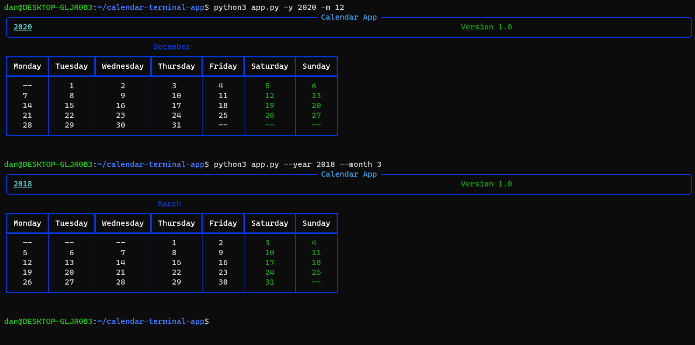
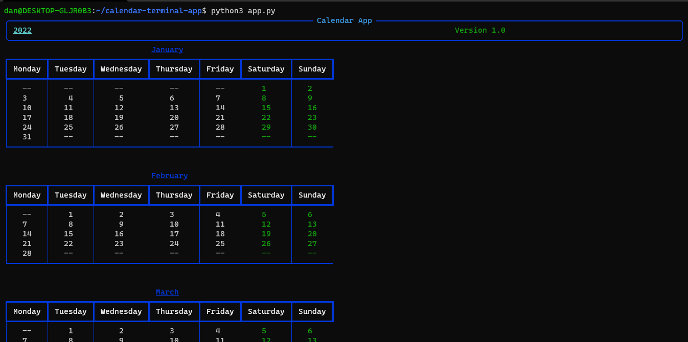

# Calendar Terminal App.

__This is a application from terminal, for watch calendars. Of years of months.__

# Installation.
```bash
git clone https://github.com/EduardYan/calendar-terminal-app.git
cd calendar-terminal-app/
```

# Dependencies.

You must install the dependencies with the requirements file, executing:

```bash
pip3 install -r requirements.txt
```

# Run and Use.

__Pass the year and the month for the calendar.__

__For default the year is the year current in the system, and the months are alls.__

```bash
# for defaults values
python3 app.py
```

```bash
python3 app.py -y 2020 -m 12
python3 app.py --year 2018 -month 3
```



__The month not must be 01, 02, 03, etc. Message error lauched.__

__See the help:__
```bash
python3 app.py -h
```


# Screenshot.


# Errors Or Bugs.

<a href="mailto:eduarygp@gmail.com">Contact Me</a>